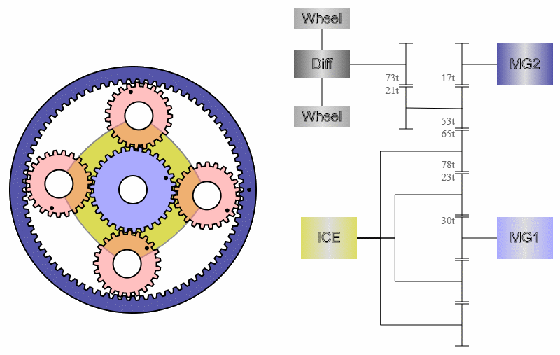

# PSD (Power Split Device) - Simulator
###[Start Online Simulator](https://adrianotiger.github.io/psd/)

Simple simulator of the planetary gear of the Toyota Hybrid cars.  
Change speed and the ICE rpm to see how the 2 electric motors will compensate on the Prius IV.

## Credits
Dukesim from [PriusFreunde.de](http://www.priusfreunde.de/portal/index.php?option=com_kunena&Itemid=117&func=view&catid=49&id=340103&limit=15&limitstart=15#569398) for the Excel-Sheet with the Prius IV data.  
Ryan Cahoon for the [Gear image generator](http://jsbin.com/oresos/latest)

## More info about PSD
Case study: Toyota Hybrid Synergy Drive  
  - http://www.ae.pwr.wroc.pl/filez/20110606092430_HEV_Toyota.pdf

## Why this project
Since the old project from http://eahart.com/prius/psd/ is wrote with Flash, it doesn't work anymore on the browser.  
This is just an improved and open source project to see the planetary gear from a hybrid car again.

